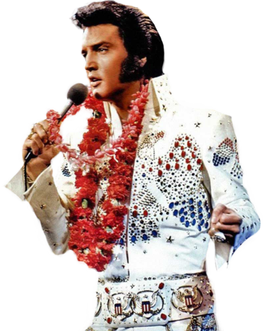

# Projeto Elvis Presley.
Projeto proposto e criado no curso de HTML5 e CSS3 da B7Web.

Este foi meu primeiro projeto onde toda a estrutra foi criada exclusivamente por mim, neste projeto pude colocar em prática novos e antigos conhecimentos, tornando a criação bem imersiva. 

Por fim, fora da proposta mas não menos importante, deixei o site responsivo.

<a href="https://munhozrufino.github.io/projeto-elvis-presley/" target="_blank" >Clique aqui para ter acesso ao site!</a>

<cite>"Valores são como impressões digitais. Ninguém é o mesmo, mas você deixa tudo em tudo o que você faz."</cite>

<cite>Elvis Presley</cite>

